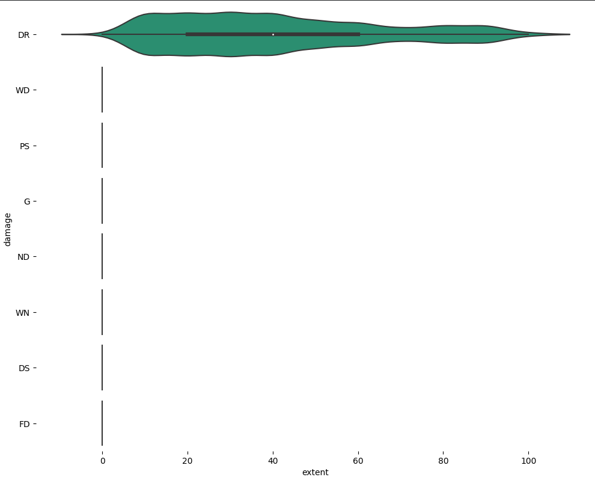
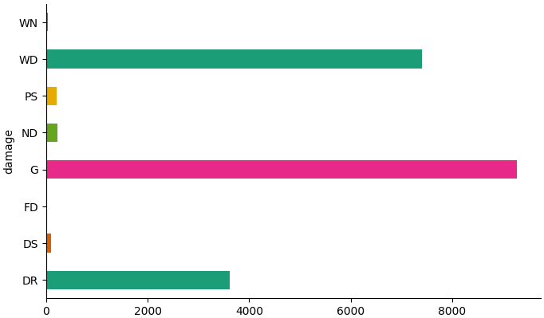
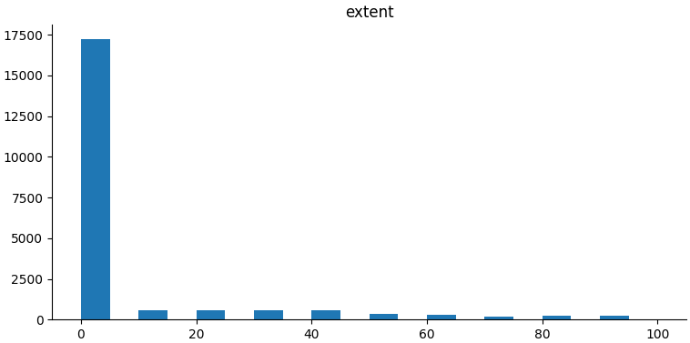

# "CGIAR Eyes on the Ground Challenge" Solution Report

## Overview
The "Eyes on the Ground" Challenge represents a fruitful collaboration between ACRE Africa, the International Food Policy Research Institute (IFPRI), and the Lacuna Fund. The primary goal of this project is to curate an extensive machine learning (ML) dataset, offering in-depth insights into smallholder farmers' fields. This dataset builds upon the foundations laid by the Picture-Based Insurance framework. The core mission is to harness the power of machine learning to streamline the insurance claims settlement process for smallholder farmers, ensuring swift and just compensation.

### Access the Challenge
For detailed information about the competition, visit the [CGIAR "Eyes on the Ground" Challenge on Zindi](https://zindi.africa/competitions/cgiar-eyes-on-the-ground-challenge).

## Data Preprocessing
The data preprocessing phase involves several steps, including data encoding and data augmentation. Images are transformed and normalized for use in the machine learning model. The preprocessing steps are critical for preparing the data for modeling.

## Exploratory Data Analysis (EDA)
The Exploratory Data Analysis (EDA) provides essential insights into the dataset:

### Data Leaks
During EDA, it was discovered that the dataset contains a column named "damage_type." This column has a significant impact on identifying the target variable, which is whether the extent of damage is zero or non-zero. Specifically, if the "damage_type" is not "DR," the target is directly set to zero. If "damage_type" is "DR," the target can take on zero or non-zero values from the set [10, 20, 30, 40, ..., 100]. This discovery highlights the presence of data leaks in the dataset.

### Imbalance in Damage Type
The EDA revealed that there is an imbalance in the "damage_type" column. Some damage types are more prevalent than others, which may impact model performance.

### zero inflated extent 
It's important to note that the target variable exhibits significant class imbalance. Over 80% of the target values are set to zero, indicating that most instances represent cases with no damage.

## Model Architecture
The model architecture used for this project is a Zero-Inflated Ordinal model. This model is designed to handle the zero-inflated nature of the target variable, which can take values of zero or non-zero.

### Model Components
1. **Image Features Extraction**: The model leverages a ConvNeXt model for extracting features from the input images. These features are critical for understanding the condition of crops in the images.

2. **Embedding Layer**: The model incorporates embeddings for processing the "season" and "growth_stage" data. These embeddings help capture the temporal and growth-related information, which is essential for accurate predictions.

3. **Hidden Layer**: After extracting image features and processing the embeddings, the model passes them through a hidden layer. This hidden layer serves to capture complex relationships between image features and temporal/growth-related data.

4. **Output Layers**:
   - **Binary Classification Layer**: The first output layer classifies whether the extent of damage is zero or non-zero. It identifies whether the crops are damaged or not. If the extent of damage is zero, no insurance payout should be made, and if it's non-zero, an insurance payout is necessary.

   - **Logits Layer**: The second output layer predicts the extent of damage when it is non-zero. This layer produces logits, which represent the potential damage values. These values can be [10, 20, 30, 40, ..., 100]. 

#### Predicting Damage Extent Using Logits
To predict the extent of damage when the target is non-zero, the logits output is utilized. The process involves the following steps:

1. **Sigmoid Activation**: The logits are passed through a sigmoid activation function, which maps the values to the range of [0, 1]. This step makes each value a probability score.

2. **Summation**: The sigmoid-activated logits are summed together, resulting in a single value representing the sum of all probabilities.

3. **Scaling**: The summed value is scaled to the actual damage values. If, for instance, the sum of probabilities indicates that 30% of the damage is present, the model outputs a damage extent of 30.

By applying sigmoid activation, summing the logits, and scaling, the model can predict the extent of damage when it is non-zero.

## Model Training and Hyperparameters
The model was trained in a Google Colab environment using a T4 GPU. Two main training phases were employed: Transfer Learning and Fine-Tuning.

### Transfer Learning
- Learning Rate: 1e-3
- Batch Size: 128
- Training Phase: In the transfer learning phase, the model leveraged a pre-trained ConvNeXt model. The convolutional layers of the ConvNeXt model were kept non-trainable (frozen), while the fully connected layers and output layers were trained on the specific task of this challenge.

### Fine-Tuning
- Learning Rate: 1e-4
- Batch Size: 128
- Training Phase: After the transfer learning phase and early stopping, the model went through fine-tuning. In this phase, all layers, including the convolutional layers, were fine-tuned with a smaller learning rate. This allowed the model to adapt its features to the specific dataset.

### Training Environment
- GPU: Google Colab environment with a T4 GPU

These hyperparameters and training phases were selected to achieve the best model performance on the given task.

## Model Prediction
As mentioned in the model architecture, the prediction process is as follows:

1. **Binary Classification Layer**: The output of the binary classification layer is passed through a softmax function, which converts the outputs into probability scores. The argmax operation is then applied to the softmax outputs:
   - If the argmax index is 0, the extent of damage is predicted to be 0, indicating no damage, and no insurance payout should be made.
   - If the argmax index is 1, it signifies that damage is present, and the extent of damage will be predicted using the logits.

2. **Predicting Damage Extent Using Logits**:
   - The logits output is passed through a sigmoid activation function, which maps the values to the range of [0, 1]. This step makes each value a probability score.
   - The sigmoid-activated logits are summed together, resulting in a single value representing the sum of all probabilities.
   - The summed value is scaled to obtain the actual damage extent. For instance, if the sum of probabilities indicates that 30% of the damage is present, the model predicts a damage extent of 30.

By applying these steps, the model can accurately predict the extent of damage when it is non-zero and determine whether any damage is present in the first place.

## Model Evaluation
The trained model's performance is evaluated, and the Root Mean Squared Error (RMSE) on the test set is used as a metric to assess the model's accuracy. The model achieves an RMSE of 9.75 on the test set.

## Conclusion
The "Eyes on the Ground" project aims to automate the process of settling insurance claims for smallholder farmers using machine learning. Through data preprocessing, EDA, and model training, the project leverages a Zero-Inflated Ordinal model to predict damage extent.